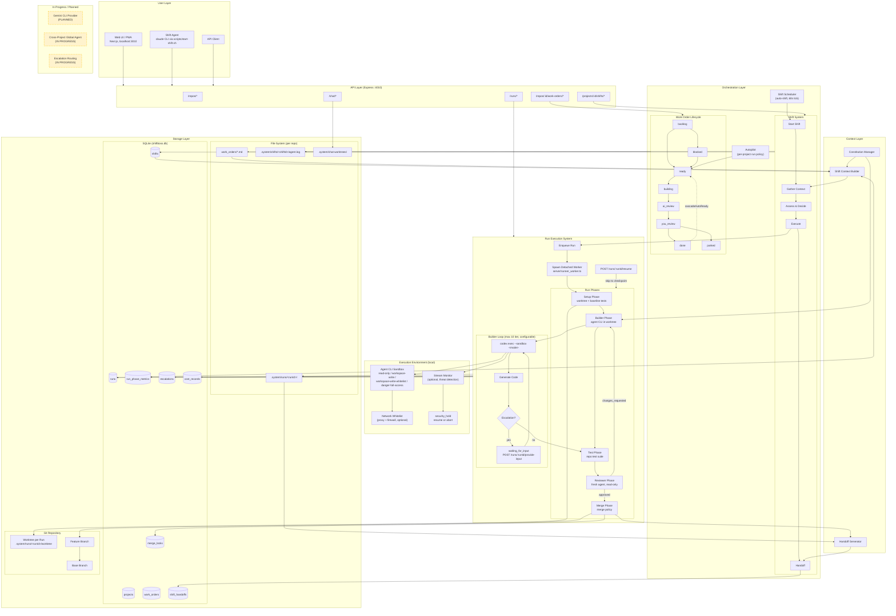

# Shiftboss System Architecture

Note: Runtime components are split across two repos. Core UI/runner live in
`shiftboss`, while hosted services (auth, billing, VM provisioning,
VM monitoring) live in the closed-source cloud codebase. See `docs/CLOUD_ARCHITECTURE.md`.

Everything in this repo executes locally: the server spawns agent CLIs
(`codex`, `claude`) as local processes, and each run is isolated in its own
git worktree. There is no remote execution layer.



## Component Details

### Work Order Lifecycle
| Status | Description |
|--------|-------------|
| `backlog` | Not ready for work |
| `ready` | Ready to be picked up |
| `building` | Run in progress |
| `ai_review` | AI reviewing changes |
| `you_review` | Awaiting human review |
| `done` | Completed |
| `blocked` | Dependencies not met |
| `parked` | Paused/deferred |

When a Work Order is marked `done`, `cascadeAutoReady` promotes its dependent
Work Orders from `backlog` to `ready` — provided all of their dependencies are
done and they satisfy the ready contract (`goal`, `acceptance_criteria`,
`stop_conditions`).

### Run Phases

Each run executes in a detached worker process (`server/runner_worker.ts`),
spawned per run so a server restart does not kill in-flight work. Progress is
checkpointed to `runs.last_completed_phase`, and `POST /runs/:runId/resume`
restarts a failed run from the last checkpoint instead of from scratch.

| Phase | Checkpoint | What happens |
|-------|------------|--------------|
| Setup | `setup` | Create git worktree from the base branch, symlink `node_modules`, copy context files into a gitignored `.context/` dir, run baseline tests (run aborts as `baseline_failed` if the repo is already broken) |
| Builder | `builder` | Agent CLI (`codex exec`) works inside the worktree against the Work Order prompt; output validated against a JSON schema; diff captured per iteration |
| Test | `test` | Repo test suite runs in the worktree; failures feed back into the next builder iteration |
| Reviewer | `reviewer_approved` | A *fresh* agent reviews a repo snapshot plus the diff (read-only sandbox by default); verdict is `approved` or `changes_requested` |
| Merge | `committed` | Apply the project's merge policy (see below); safe staging skips deletions and protects `work_orders/` and other configured paths |

The builder/test/reviewer loop is bounded by `SHIFTBOSS_MAX_BUILDER_ITERATIONS`
(default 10, hard cap 20). Phase durations are not hardcoded — every phase is
recorded in `run_phase_metrics`, and per-project averages drive run-time
estimates (`GET /repos/:id/run-metrics/summary`,
`GET /repos/:id/estimation-context`). Estimates and a live ETA are stored on
the run row and updated as phases complete.

### Sandboxing and Network Access

Builders and reviewers run as local CLI processes under the agent CLI's
sandbox:

| Setting | Values | Default |
|---------|--------|---------|
| `SHIFTBOSS_BUILDER_SANDBOX` (or per-project `builder_sandbox_mode`) | `read-only`, `workspace-write`, `workspace-write-whitelist`, `danger-full-access` | `workspace-write` |
| `SHIFTBOSS_REVIEWER_SANDBOX` | `read-only`, `workspace-write`, `danger-full-access` | `read-only` |

Optional guardrails on top of the sandbox:

- **Network whitelist** — egress proxy + firewall restricting builder network
  access to approved hosts (`/settings/network-whitelist`).
- **Stream monitor** — watches live agent output for threats; can auto-kill
  the process and place the run in `security_hold`
  (`POST /runs/:runId/security-hold/resume` or `.../abort`).

### Merge Policies

After reviewer approval, the per-project merge policy decides what happens
(see `docs/merge-policy.md`):

| Policy | Behavior |
|--------|----------|
| `auto_merge` | Commit in the worktree, merge the base branch into the run branch (a conflict spawns a dedicated conflict-resolution builder plus re-review), take the per-project merge lock, merge into the base branch, clean up the worktree |
| `human_approve` | Run pauses in `approved`; a human triggers `POST /runs/:runId/approve-merge` |
| `pull_request` | Push the run branch and open a GitHub PR via `gh`; run moves to `pr_open` |

### Escalations

A builder that hits a stop condition or needs a decision emits an escalation.
The run moves to `waiting_for_input` and blocks until a human responds via
`POST /runs/:runId/provide-input`; the resolution is injected into the next
builder attempt.

### Shift Lifecycle
1. **Start** — Create shift with timeout (default 120 min) via `POST /projects/:id/shifts`
2. **Context** — Gather project state, WOs, runs, git status (`GET /projects/:id/shift-context`)
3. **Assess & Decide** — Choose which WO to work on
4. **Execute** — Kick off runs, monitor progress
5. **Handoff** — Document work done, blockers, recommendations (`POST /projects/:id/shifts/:shiftId/complete`)

The shift agent is the local `claude` CLI, launched either manually
(`scripts/start-shift.sh`) or by the shift scheduler, which checks
auto-shift-enabled projects every 60 seconds and spawns shift agents subject
to a minimum interval, cooldown, daily cap, and quiet hours. Shift logs go to
`.system/shifts/<shiftId>/agent.log` (`GET /projects/:id/shifts/:shiftId/logs`).
Handoffs are auto-generated from run artifacts (`server/handoff_generator.ts`)
and stored in `shift_handoffs`.

### Chat

Chat threads are scoped (global, per-project, per-work-order) and backed by an
agent CLI worker. Threads that edit files get their own git worktree under
`.system/chat-worktrees/`, with diff review and merge-back endpoints
(`GET /chat/threads/:threadId/worktree/diff`).

### Run Artifacts

Each run writes to `.system/runs/<runId>/` inside the target repo:

- `worktree/` — the isolated git worktree for the run
- `builder/iter-N/`, `reviewer/iter-N/` — per-iteration prompts, logs, results
- `tests/` — baseline and per-iteration test results
- `baseline/` — pre-build snapshot used to compute diffs
- `diff.patch`, `iteration_history.json`, `run.log`, `escalation.json`

`GET /runs/:runId/logs/tail` serves the live run log to the UI.

### In Progress / Planned (Yellow/Dashed)
- **Gemini CLI provider** — defined in the provider interface (`server/providers/`), not yet runnable
- **Cross-project global agent** — global sessions/initiatives APIs exist and are maturing
- **Escalation routing** — routing escalations to the right person/channel

## Data Flow

```
User Request (UI / shift agent / API client)
    ↓
API Endpoint (Express :4010)
    ↓
Orchestration (Shift decision / Autopilot / manual WO selection)
    ↓
Run Enqueue → Detached Runner Worker
    ↓
Worktree Setup → Baseline Tests
    ↓
Builder → Test → Reviewer (loop until approved or max iterations)
    ↓
Merge Policy (auto-merge | human approve | GitHub PR)
    ↓
Handoff Generated → Shift Complete → Next Shift
```
